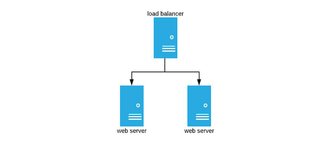
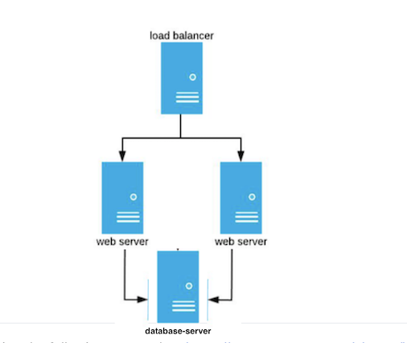

# DevOps Test Documentation

This DevOps Test is an environment with three virtual machines(VM), a VM as a load-balancer and the other two VM as endpoint servers. <br>
One VM acting as a load-balancer is sitting in front(frontend) that distributes network/application/routing client requests traffic across the other two VM (backend) acting as application webservers.

## Description
These instructions will get you a copy of the project up and running on your local machine with the necessary tools installed to simulate a web-based loading balancing architecture.

## Installing
##### Prerequisites

(1) Virtual environment architecture
For the initial setting please download the vagrant proper package from the official website for your operating system and architecture : (https://www.vagrantup.com/downloads)

`$ vagrant --version`
 - Vagrant 2.2.14 (This lab was usising this version described)
    - For MAC OS X (https://releases.hashicorp.com/vagrant/2.2.14/vagrant_2.2.14_x86_64.dmg)
    - For Debian distributions (https://releases.hashicorp.com/vagrant/2.2.14/vagrant_2.2.14_x86_64.deb)
    - For Centos distributions (https://releases.hashicorp.com/vagrant/2.2.14/vagrant_2.2.14_x86_64.rpm)
    - For Windows distributions (https://releases.hashicorp.com/vagrant/2.2.14/vagrant_2.2.14_x86_64.msi)
    - Binary can be found at (https://releases.hashicorp.com/vagrant/2.2.14/)

(2) Automation configuration management tool:
For automation provisioning configuration management in this DevOps Test Ansible was the tool chosen, other tools can be equally used by preference:

 - Ansible = 2.9.7 (https://www.ansible.com)
    - ansible dependency - python version = 3.8.2
`$ ansible --version`
```
ansible 2.9.7
  config file = /etc/ansible/ansible.cfg
  configured module search path = ['/Users/USERNAME/.ansible/plugins/modules', '/usr/share/ansible/plugins/modules']
  ansible python module location = /usr/local/Cellar/ansible/2.9.7/libexec/lib/python3.8/site-packages/ansible
  executable location = /usr/local/bin/ansible
  python version = 3.8.2 (default, Mar 11 2020, 00:29:30) [Clang 10.0.0 (clang-1000.11.45.5)]
```

This one bellow (Chef) is an alternative for configuration management.
 - Chef (https://www.chef.io)


### Optional Prerequisites 
Optionally a virtualization tool package 'VirtualBox' for hardware administration can be used (GUI for interactiveness virtualization): (https://www.virtualbox.org/wiki/Downloads)

 - VirtualBox 6.1.18 
   - For Windows hosts (https://download.virtualbox.org/virtualbox/6.1.18/VirtualBox-6.1.18-142142-Win.exe)
   - For MAC OS X hosts (https://download.virtualbox.org/virtualbox/6.1.18/VirtualBox-6.1.18-142142-OSX.dmg)
   - For Linux architecture (https://www.virtualbox.org/wiki/Linux_Downloads)


### Objectives

Here's the diagram of the infrastructure required:




## The brief:

&mdash; All VMs built using the following vagrant box:https://app.vagrantup.com/ubuntu/boxes/bionic64

&mdash; All VMs allow the vagrant user, and users in the admin group, to sudo without a password

&mdash; Web servers and load balancer running Nginx

&mdash; Simple ‘Hello World’ application deployed to both webservers

&mdash; Automated tests to show that app is deployed correctly and Nginx is load balancing correctly

&mdash; Solution is idempotent

You may use vagrant’s built-in provisioner to install the config manager of your choice.

We’re interested in your working as much as your answers, so where you decide to go oneway rather than another, ​*please explain your thinking​*. Your solution will be assessed on code quality and comprehensibility, as well as the quality of your documentation, not just on technical correctness


#### Optional extra credit:

   - Include a section for possible improvements and compromises made during the development of your solution
   
   - Have the web app be dynamic - e.g. perform a DB query for inclusion in the response (such as picking a random quote from a database) or calling an API of your choice(e.g. weather).
   
   - => Any additional resources (e.g. a shared DB server) should be set up by the Vagrant file and configured using config management some points to note:
   
   - We will assess you based on the quality of the solution, documentation and how easily someone else can pick it up
   
   - It’s fine for your implementation to deviate from the task as documented (we love innovative ideas!) - but please give full details of what you have changed and why - We’re interested in your working as much as your answers, so where you decide to go one way rather than another, please explain your thinking.
   
   - Please give a rough indication of the number of hours spent completing this task finally, you are almost there! Once you have completed this technical test in your own time and returned it to us, we will aim to assess it within 48 hours.


#### Some points to note:

   - We will assess you based on the quality of the solution, documentation and how easily someone else can pick it up
   
   - It’s fine for your implementation to deviate from the task as documented (we love innovative ideas!) - but please give full details of what you have changed and why - We’re interested in your working as much as your answers, so where you decide to go one way rather than another, please explain your thinking.
   
   - Please give a rough indication of the number of hours spent completing this task
   
   Finally, you are almost there! Once you have completed this technical test in your own time and returned it to us, we will aim to assess it within 48 hours.


<hr>

### Getting Started

After getting the project on the local machine, run the following command to create and provision the environment.
```
$ vagrant up # that will start with setting up the virtual LAM
```
This may take some time as it will be the only command need to have this project up and running.


Additional commands for redeploying changes or delete the entire LAM can be also found bellow with a description:

Reprovision the configuration  (this will call ansible with roles and task)
```
$ vagrant provision
```

Stop all the VMS to pick up later ( all the virtual machines created by the vagrant file will be on stop status)
```
$ vagrant halt
```

To clean up the session and delete all the virtual machines in the environment created by the vagrant file
```
$ vagrant destroy
```

All these vagrant commands can be also applied individually in the machines passing the VM's name as a parameter to the vagrant command.
i.e:
```
#to destroy one of the VMS only
$ vagrant destroy web-server-1
```

All the vagrant commands can be found from here --> https://www.vagrantup.com/docs/provisioning/ansible_common

<hr>

### Variables and modification
There is a variable file on `./vagrant-al/ansible-provision/vars/vars.yml` where a few modification and applicability can be customised, this will after the machines internally not to virtual hardware.

Additionally, for playbooks we can tweak the main file that calls the roles that do the configuration in the servers, this one can be check at this path location: `/vagrant-projects/vagrant-al/ansible-provision/playbook.yml`.


For virtual hardware modifications, there is another file `Vagrantfile` that can be used to spin more or fewer virtual servers accordantly with desiderated/projects.


### Action 

A step by step series of examples that tell you to have to get a development env running

Create the env/servers and provision in one command:

```
vagrant up 
```

The server can be accessed by ssh using:
```
vagrant ssh SERVER_NAME
```


After vagrant and ansible finish with the creation and configuration of the infrastructure the web-app demo can be visited by using CNAME entry hosts or IP:

##### Entry host CNAME/alias 
|-->  http://load-balancer-0   <--|

##### IP Address LB
| --> http://192.168.50.5  <--|


 - The initial requirement was having two servers behind the load-balancer and an Optional extra server for a database working with the web-servers and tests for connectivity and response healthy, which I have created and managed to write the ansible roles for the database, including this documentation.  

 So the final infrastructure ends up as following the diagram.




## Running the tests

The test is also part fo the bootstrap configuration but can be done separately:
Open the playbook.yml and comment out all the roles leaving the the test-role and run:
i.e

```
...
    roles:
#      - { role: host_facts, tags: ['always'] } 
#      - { role: add_user, tags: ['always'] } 
#      - { role: install_config_mysql_server, tags: [database_server] }
#      - { role: create_import_database_mysql, tags: [database_server] }
#      - { role: deploy_webapp, tags: ['web_server'] } 
#      - { role: install_nginx, tags: [web_server, load_balancer] }
#      - { role: nginx_web_server_conf, tags: [web_server] }
#      - { role: nginx_load_Balancer_conf, tags: [load_balancer] }

      - { role: nginx_load_web_tests, tags: [web_server, load_balancer] }    <-- This uncommented to test the load_balancer and web_servers
```

```
vagrant provision
```

Or 

```
vagrant provision load_balancer # for restrict it to load_balancer only
```

#### Break down into the basics tests

- Test (Hello World) path to check if returns 'Hello World' from (http://localhost/hello) if yes Good!
- Test code web-services returns '200 OK' with Content-Type specified
- Test Nginx configuration before restart it and risk disrupting the services


## The basic deployment is:

I have built a small web-app blog post to deploy and simulate the LAM env with a database server, a load-balancer and two web-servers.
Clone the web-app into the server and deployed it into the servers after the server is configured.
The Ansible roles are independent and respond to changes based on the server itself or at the file/dir level.

## Suggestions
I believed this LAB DevOps test could be also be added a few bit to make it even more interesting, I find it quite cool to create/configure and also develop a demo app unique to this project. 
One more task that we could also add is to deploy all of it as required with SSL configuration to simulate it to an even more close to a production environment, and also to make the interested DevOps learn more about the infoSec word (which I am also quite interested to learn more).

Overall, a very interesting project for hobbyists like me and a good source of learning.


## Built With

* [Dropwizard](http://www.dropwizard.io/1.0.2/docs/) - The web framework used
* [Maven](https://maven.apache.org/) - Dependency Management
* [ROME](https://rometools.github.io/rome/) - Used to generate RSS Feeds


## Versioning
```
$ vg --version
Vagrant 2.2.14


$ ansible --version
ansible 2.9.7
  config file = /etc/ansible/ansible.cfg
  configured module search path = ['/Users/USER/.ansible/plugins/modules', '/usr/share/ansible/plugins/modules']
  ansible python module location = /usr/local/Cellar/ansible/2.9.7/libexec/lib/python3.8/site-packages/ansible
  executable location = /usr/local/bin/ansible
  python version = 3.8.2 (default, Mar 11 2020, 00:29:30) [Clang 10.0.0 (clang-1000.11.45.5)]

$ git --version
git version 2.29.2


```


## Authors

* **Osvaldo Caliari** - *Initial work* - [authos project repositories](https://github.com/Calliari/)
Demo web-app deploied --> https://github.com/Calliari/flask-blog-app

## References/Acknowledgments

* Provisioning vagrant with Ansible (https://www.vagrantup.com/docs/provisioning/ansible)
* Connecting Ansible to vagrant (https://www.vagrantup.com/docs/provisioning/ansible_intro)
* Nginx http-load-balancer (https://docs.nginx.com/nginx/admin-guide/load-balancer/http-load-balancer/) && (https://nginx.org/en/docs/http/load_balancing.html)